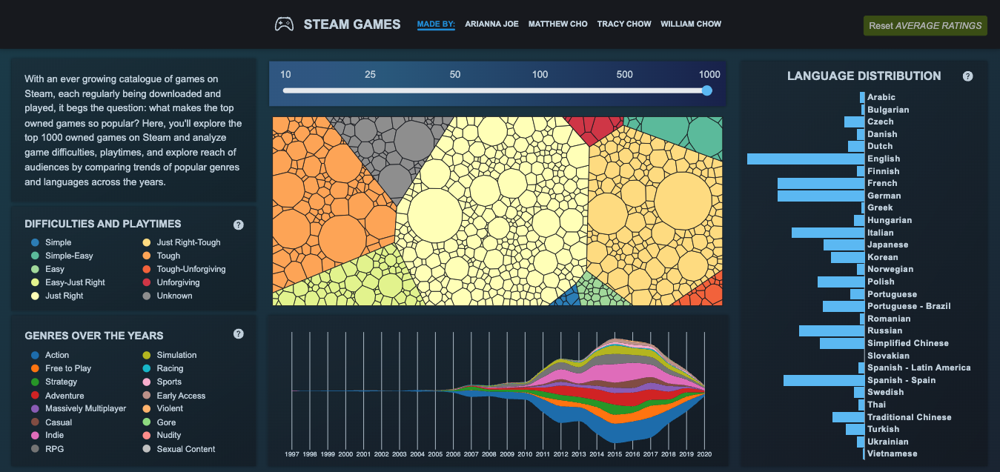

# Analyzing Steam Games

A project created for CPSC 447: Intro to Visualization.

Group Members: Arianna Joe, Matthew Cho, Tracy Chow, William Chow

## Overview
With an ever growing catalogue of games on Steam, it can be hard to compare games against each other, discover what kind of features they have in common and figure out why some games are owned by so many people. To help users delve into exploring Steam game statistics, we propose to create a visualization where users will be able to explore top owned games while analyzing game difficulties and playtimes. Users will also be able to explore the reach of audiences by comparing trends of popular genres and languages across the years.

This project is built upon the Steam Games DB provided here: https://github.com/leinstay/steamdb

The project is designed to be optimal on a screen size of 1536 x 725 and is supported on the
Chrome browser.